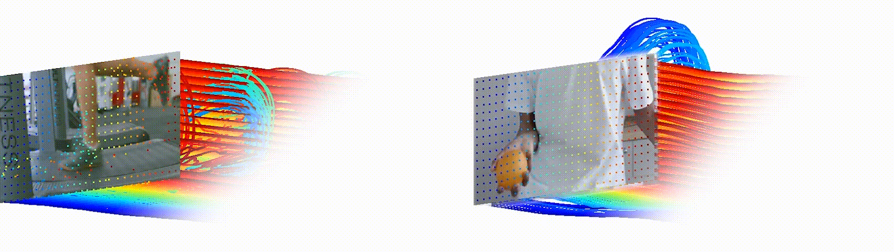

# Dense Optical Tracking: Connecting the Dots


[Guillaume Le Moing](https://16lemoing.github.io/),
[Jean Ponce](https://www.di.ens.fr/~ponce/),
[Cordelia Schmid](https://thoth.inrialpes.fr/~schmid/)
<br>

#### [Project Page](https://16lemoing.github.io/dot) | [Paper](https://arxiv.org/abs/2312.00786) | [Video](https://www.youtube.com/watch?v=H0Rvq0OL87Y) | [BibTeX](#citation)

<p align="center"></p>

**DOT** unifies point tracking and optical flow techniques:
- It tracks all pixels in a frame simultaneously.
- It retains the robustness to occlusions and the accuracy of point tracking techniques.
- It enjoys the spatial consistency and runs at a comparable speed to optical flow techniques.

## Installation

### Set Up Environment
Clone the repository.
```
git clone https://github.com/16lemoing/dot
cd dot
```

<details>
<summary>Install dependencies.</summary>

[Optional] Create a conda environment.
```
conda create -n dot python=3.9
conda activate dot
```

Install the [PyTorch and TorchVision](https://pytorch.org/get-started/locally/) versions which are compatible with your CUDA configuration.
```
pip install torch==2.0.1 torchvision==0.15.2
```
Install inference dependencies.
```
pip install tqdm matplotlib einops scipy timm lmdb av mediapy
```

[Optional] Install training dependencies.
```
pip install tensorboard
```

[Optional] Set up custom modules from [PyTorch3D](https://github.com/facebookresearch/pytorch3d) to increase speed and reduce memory consumption of interpolation operations.
```
cd dot/utils/torch3d/ && python setup.py install && cd ../../..
```
</details>

### Download Checkpoints
```
wget -P checkpoints https://huggingface.co/models/16lemoing/dot/resolve/main/cvo_raft_patch_8.pth
wget -P checkpoints https://huggingface.co/models/16lemoing/dot/resolve/main/movi_f_raft_patch_4_alpha.pth
wget -P checkpoints https://huggingface.co/models/16lemoing/dot/resolve/main/movi_f_cotracker_patch_4_wind_8.pth
```

## Demo

Download demo data.
```
wget -P datasets https://huggingface.co/models/16lemoing/dot/resolve/main/demo.zip
unzip datasets/demo.zip -d datasets/
```

### :spaghetti: - Spaghetti 

Produce videos from the teaser figure.
```
python demo.py --visualization_modes spaghetti_last_static --video_path orange.mp4
python demo.py --visualization_modes spaghetti_last_static --video_path treadmill.mp4
```

https://github.com/16lemoing/dot/assets/32103788/82b888b8-3bc4-4ce8-9278-1adf39eb842a

```
python demo.py --visualization_modes spaghetti_last_static --video_path umbrella.mp4
```

https://github.com/16lemoing/dot/assets/32103788/088cc2d6-0cd3-449c-a42a-58f4371427d0

```
python demo.py --visualization_modes spaghetti_first_last_mask --video_path skateboard.mp4 --mask_path skateboard.png
```

### :rainbow: - Overlay 

https://github.com/16lemoing/dot/assets/32103788/7cc812c1-67fe-4710-9385-6675dd95cbf9


```
python demo.py --visualization_modes overlay --video_path cartwheel.mp4
```


https://github.com/16lemoing/dot/assets/32103788/580ef7eb-4ae0-4174-9d62-9cfb62651c99

```
python demo.py --visualization_modes overlay_stripes_mask --video_path varanus.mp4 --mask_path varanus.png
```

## Evaluation

### Data Preprocessing
Download Kubric-CVO test data.
```
wget -P datasets/kubric/cvo https://huggingface.co/datasets/16lemoing/cvo/resolve/main/cvo_test.lmdb
wget -P datasets/kubric/cvo https://huggingface.co/datasets/16lemoing/cvo/resolve/main/cvo_test_extended.lmdb
```
Download TAP test data.
```
wget -P datasets/tap https://storage.googleapis.com/dm-tapnet/tapvid_davis.zip
wget -P datasets/tap https://storage.googleapis.com/dm-tapnet/tapvid_kinetics.zip
wget -P datasets/tap https://storage.googleapis.com/dm-tapnet/tapvid_rgb_stacking.zip
unzip "datasets/tap/*.zip" -d datasets/tap/
```

### Compute Evaluation Metrics
```
python test_cvo.py --split {clean|final|extended}
python test_tap.py --split {davis|kinetics|rgb_stacking}
```

## Training

### Data Preprocessing

<details>
<summary>Download preprocessed data.</summary>

Download Kubric-MoviF train data.
```
wget -P datasets/kubric/movi_f https://huggingface.co/datasets/16lemoing/movi_f/resolve/main/video_part.zip
wget -P datasets/kubric/movi_f https://huggingface.co/datasets/16lemoing/movi_f/resolve/main/video_part.z01
wget -P datasets/kubric/movi_f https://huggingface.co/datasets/16lemoing/movi_f/resolve/main/ground_truth.zip
wget -P datasets/kubric/movi_f https://huggingface.co/datasets/16lemoing/movi_f/resolve/main/cotracker.zip
```

Unzip data.
```
zip -F video_part.zip --out datasets/kubric/movi_f/video.zip
unzip datasets/kubric/movi_f/video.zip -d datasets/kubric/movi_f/
unzip datasets/kubric/movi_f/ground_truth.zip -d datasets/kubric/movi_f/
unzip datasets/kubric/movi_f/cotracker.zip -d datasets/kubric/movi_f/
```
</details>

<details>
<summary>Or run preprocessing steps yourself.</summary>

Install additional dependencies.
```
pip install joblib tensorflow tensorflow_datasets tensorflow-graphics
```

Download Kubric-MoviF train data.
```
python preprocess.py --extract_movi_f
```
[Requires a GPU] Save tracks from CoTracker for Kubric-MoviF train data.
```
python preprocess.py --save_tracks
```
</details>


### Optimization

```
python train.py
```

## License

Most of our code is licensed under the MIT License.
However, some parts of the code are adapted from external sources and conserve their original license:
CoTracker is licensed under CC-BY-NC,
RAFT uses the BSD 3-Clause License,
Kubric and TAP use the Apache 2.0 License,
and PyTorch3D is licensed under a BSD License.

## Contributing

We actively encourage contributions. Want to feature a cool application which builds upon DOT, or add support to another point tracker / optical flow model? Don't hesitate to open an issue to discuss about it.

## Citation
Please note that any use of the code in a publication must explicitly refer to:
```
@article{lemoing2023dense,
  title={Dense Optical Tracking: Connecting the Dots},
  author={Guillaume Le Moing and Jean Ponce and Cordelia Schmid},
  journal={arXiv preprint},
  year={2023}
}
```
